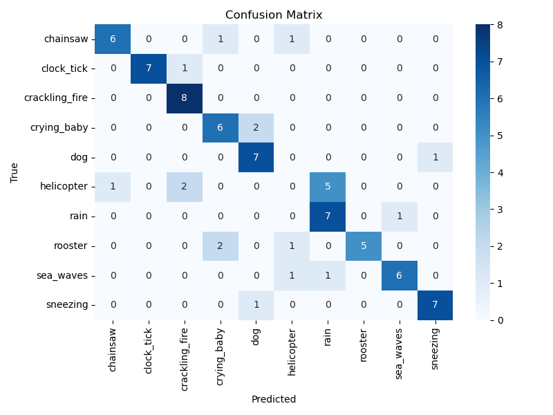

# ESC-10 Audio Classification Project

This project explores multiple deep learning architectures for classifying 10 types of environmental sounds from the ESC-10 subset of the ESC-50 dataset. The models evaluated include:

- A CNN-based classifier trained on spectrograms
- A Transformer-based classifier trained on spectrograms
- A simple feedforward classifier trained on HuBERT embeddings
- A Transformer-based classifier trained on HuBERT embeddings

---

## 📊 Evaluation Summary

| Model                      | Accuracy | Weighted F1 | Evaluation Log                     |
|---------------------------|----------|-------------|------------------------------------|
| CNN + Spectrogram         | 0.41     | 0.39        | `evaluation_log.txt`               |
| Transformer + Spectrogram | 0.56     | 0.57        | `transformer_eval_log.txt`         |
| Simple + HuBERT Embedding | 0.85     | 0.85        | `hubert_eval_log.txt`              |
| Transformer + HuBERT      | 0.74     | 0.72        | `hubert_transformer_eval_log.txt`  |

---

## 📈 Confusion Matrices

| CNN                         | Transformer                     |
|----------------------------|----------------------------------|
|  |  |

| HuBERT (Simple)            | HuBERT (Transformer)            |
|---------------------------|----------------------------------|
|  |  |

---

## 🧠 Theoretical Insights

1. **CNNs on spectrograms** show relatively poor performance (41% accuracy), likely due to limited capacity for global temporal structure and reliance on local filters.

2. **Transformers on spectrograms** improve modestly (56% accuracy), leveraging global attention but possibly struggling with sparse high-dimensional inputs and limited data.

3. **HuBERT embeddings** significantly boost performance (up to 85% with a simple classifier). These embeddings capture semantic acoustic structure learned from large-scale pretraining, allowing downstream models to classify with less overfitting.

4. **Transformer on HuBERT** performs slightly worse than the simple classifier (74% vs 85%). This may reflect overfitting due to limited data or insufficient architectural tuning (e.g., no dropout, overly deep layers).

---

## 🛠️ Conclusions

- Pretrained models like **HuBERT** can drastically improve performance even with shallow classifiers.
- Simpler models sometimes generalize better than deeper ones on small datasets.
- Transformers need careful regularization and possibly more data or pretraining for optimal performance on audio.

---

## 📁 Files

- `*.py` pipelines for CNN, Transformer, HuBERT, and hybrid models
- `*.png` confusion matrices for visual comparison
- `*_eval_log.txt` classification reports per model

