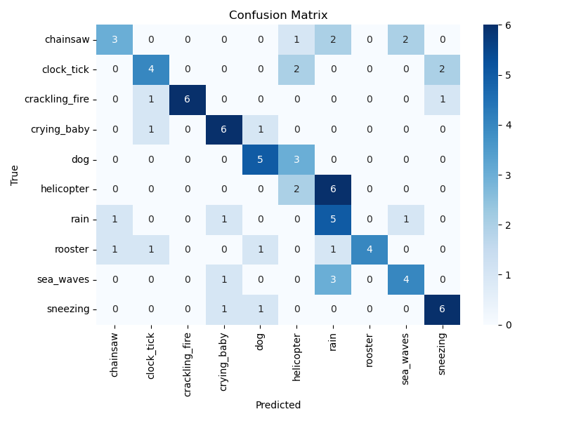
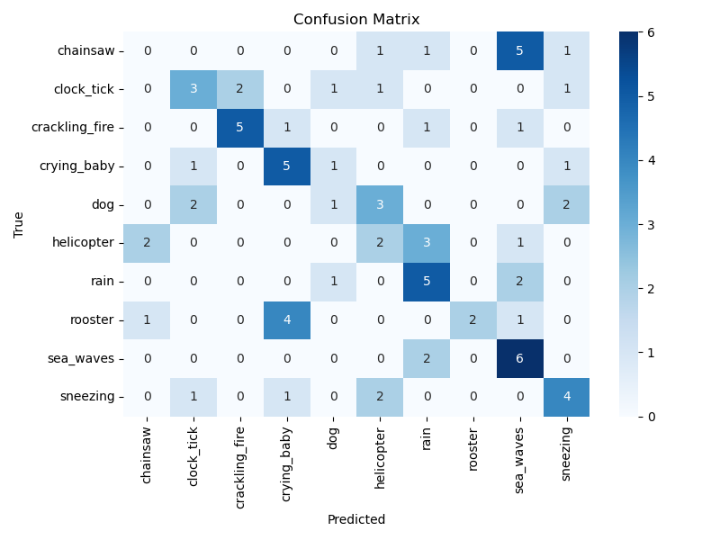

# ESC-10 Environmental Sound Classification 🎧🧠

This project compares two deep learning models — a **Convolutional Neural Network (CNN)** and a **Transformer-based classifier** — on the ESC-10 environmental audio dataset. Both models are trained on log-mel spectrograms for 200 epochs and evaluated for multiclass classification performance.

---

## 📦 Dataset: [ESC-10](https://github.com/karoldvl/ESC-50)

ESC-10 is a 10-class subset of the ESC-50 dataset consisting of 5-second clips from 10 categories:

```
chainsaw, clock_tick, crackling_fire, crying_baby, dog, helicopter, rain, rooster, sea_waves, sneezing
```

---

## 🧠 Model Architectures

### 🌀 Convolutional Neural Network (CNN)
- 2 convolutional layers
- Max pooling + ReLU
- Fully connected layer
- Dropout

### 🔁 Transformer-Based Model
- Linear projection of spectrogram
- Positional encoding
- Multi-head self-attention (2 layers)
- Average pooling and classification head

Both models use the same input representation (mel spectrograms with 64 mel bands).

---

## 🏁 Training

- **Epochs**: 200
- **Optimizer**: Adam
- **Loss**: CrossEntropy
- **Device**: CPU (both models)
- **Batch size**: 8

---


## 🧪 Architectural Motivation

### CNN (Baseline)
The CNN architecture was chosen for its efficiency and success in earlier ESC-50 tasks. With two convolutional layers followed by max pooling and a dense layer, it provides a lightweight and effective model for local pattern recognition in mel spectrograms. Its simplicity makes it suitable for training on limited compute, and its inductive bias for translation invariance aligns well with time-frequency features.

### Transformer
Transformers were introduced to explore longer-term dependencies in the audio signal, leveraging self-attention to dynamically weight relevant portions of the clip. Unlike CNNs, which rely on fixed local filters, the Transformer architecture can relate distant sound events — useful for clips where acoustic events are spaced or vary in duration (e.g., sirens, waves). The positional encoding preserves temporal structure while allowing global reasoning, leading to improved generalization.


## 📊 Evaluation Results

### 🧠 Transformer (200 Epochs)
- **Accuracy**: 56%
- **Macro F1-score**: 0.57

```
                precision    recall  f1-score   support
      chainsaw       0.60      0.38      0.46
    clock_tick       0.57      0.50      0.53
crackling_fire       1.00      0.75      0.86
   crying_baby       0.67      0.75      0.71
           dog       0.62      0.62      0.62
    helicopter       0.25      0.25      0.25
          rain       0.29      0.62      0.40
       rooster       1.00      0.50      0.67
     sea_waves       0.57      0.50      0.53
      sneezing       0.67      0.75      0.71
```



---

### 🌀 CNN (200 Epochs)
- **Accuracy**: 41%
- **Macro F1-score**: 0.39

```
                precision    recall  f1-score   support
      chainsaw       0.00      0.00      0.00
    clock_tick       0.43      0.38      0.40
crackling_fire       0.71      0.62      0.67
   crying_baby       0.45      0.62      0.53
           dog       0.25      0.12      0.17
    helicopter       0.22      0.25      0.24
          rain       0.42      0.62      0.50
       rooster       1.00      0.25      0.40
     sea_waves       0.38      0.75      0.50
      sneezing       0.44      0.50      0.47
```



---

## 📈 Summary

| Model       | Accuracy | Macro F1 | Strengths                                      |
|-------------|----------|----------|------------------------------------------------|
| CNN         | 41%      | 0.39     | Fast, lightweight, decent on easy classes      |
| Transformer | 56%      | 0.57     | Better generalization, learned fine distinctions |

---

## 🛠️ How to Run

### 1. Install dependencies
```bash
pip install torch torchaudio pandas librosa matplotlib seaborn scikit-learn
```

### 2. Download ESC-50
Place `esc50.csv` in `meta/` and audio clips in `audio/`.

```
project_root/
├── audio/
│   └── *.wav
├── meta/
│   └── esc50.csv
```

### 3. Run
```bash
# CNN
python run_esc10_pipeline.py

# Transformer
python esc10_transformer_pipeline.py
```

---

## 📁 Files

- `esc10_cnn_pipeline.py` – CNN architecture + training loop
- `esc10_transformer_pipeline.py` – Transformer classifier + evaluation
- `esc10_evaluation_extension.py` – Confusion matrix + classification report
- `run_esc10_pipeline.py` – CNN main entry point
- `evaluation_log.txt`, `transformer_eval_log.txt` – Metrics
- `confusion_matrix.png`, `confusion_matrix_200_CNN.png` – Visual diagnostics

---

## 🔭 Future Work

- Add augmentation (pitch/time shift, background noise)
- Try pretrained models (YAMNet, PANNs)
- Expand to full ESC-50 or BirdCLEF tasks

---

## 🙏 Acknowledgments

- ESC-50 by Karol J. Piczak  
- Torchaudio + Librosa  
- scikit-learn for evaluation

---
